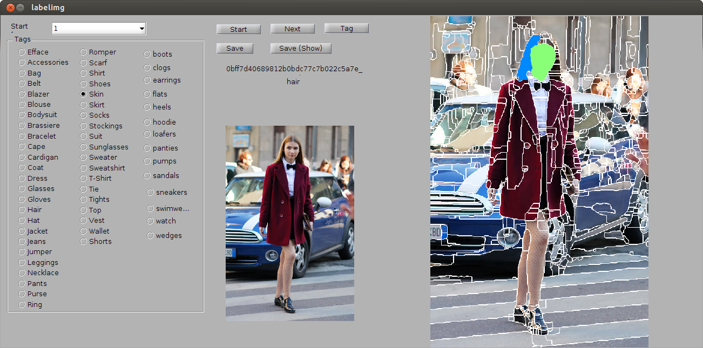
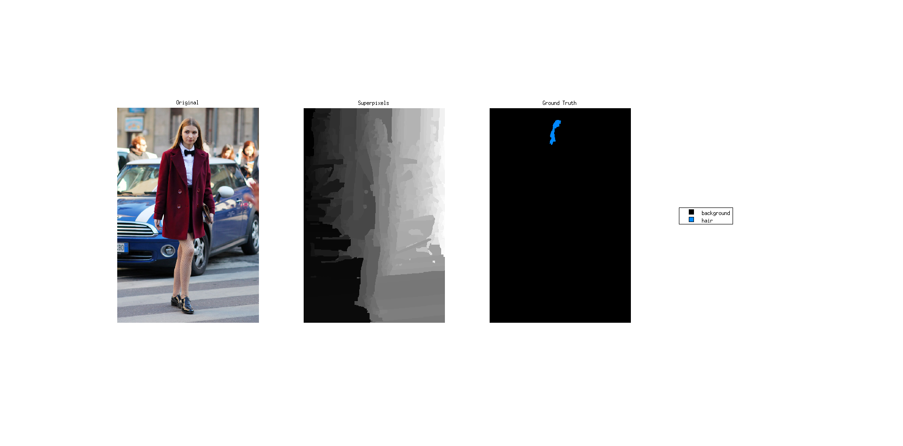

# clothing-co-parsing-label-tool
An ugly tool for labeling segmentations given images and the corresponding superpixels. **You may need to modify the code to work on your own project.**

## Prerequisites
Put your images in the `seleted_full` folder, and the corresponding superpixels in the `selected_ucm` folder. In this demo, we use the [Berkeley segmentation algorithm](http://www.eecs.berkeley.edu/Research/Projects/CS/vision/grouping/BSR/BSR_code.tgz) to generate the superpixels.

## Usage
1. Run `labelimg`, and the GUI of the label tool appears. The **dropdown menu** allows you to select the image you want to start. After pressing the `start` button, the original image and the superpixels will be loaded and displayed in the middle and the right panels.
	
2. Select a clothing class you want to annotate by selecting the radio buttons in the left panel. Click down and drag the mouse on the right panel to annotate the images. 
3. The wrongly annotated superpixels can be overlaped. You can also choose `Efface` on the left panel to erase the annotations by click down and drag the mouse on the region you want to disgard.
4. Click `save` button to save the annotations. The superpixel-level annotations will be saved in the `pixel-level` folder, and the tags will be saved in the `image-level` folder.
5. Click `save (show)` button to save and visualize your annotations.
  

## Miscellaneous
You may interested in our [clothing parsing dataset]. The related paper is published in CVPR 2014.

```
@inproceedings{yang2014clothing,
  title={Clothing Co-Parsing by Joint Image Segmentation and Labeling},
  author={Yang, Wei and Luo, Ping and Lin, Liang}
  booktitle={Computer Vision and Pattern Recognition (CVPR), 2014 IEEE Conference on},
  year={2013},
  organization={IEEE}
}
```